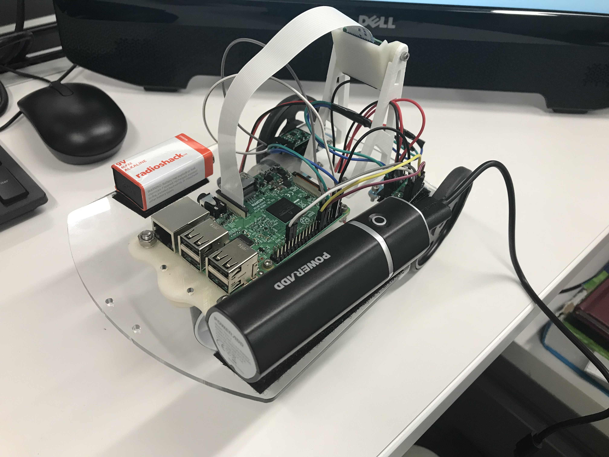
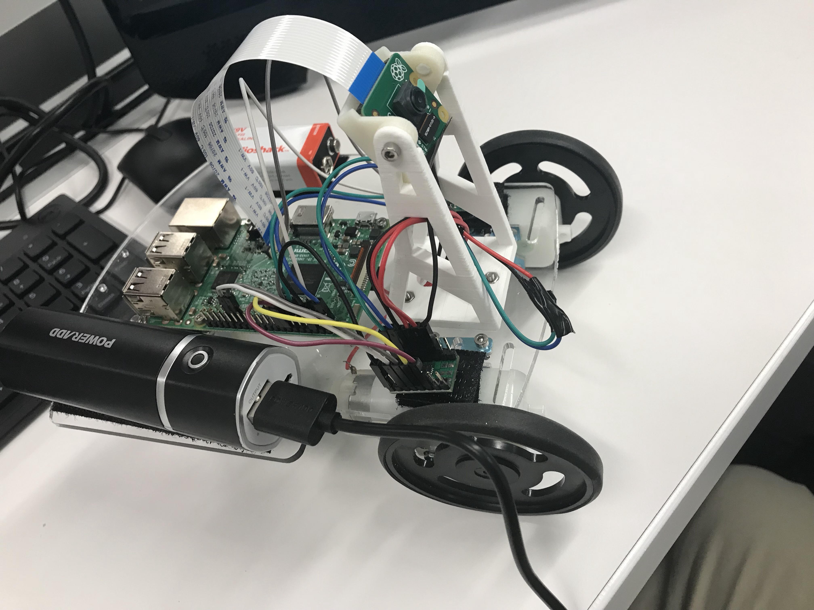

This repository is about my learning experience in Robotics class using Robot Operating System. 
This class provides a hands-on experience in robotics (Python and ROS), alognside theoretical fundamental notions in three main areas:  
(i) Modeling  
(ii) Computer Vision  
(iii) Control  

Hardwares:  
Raspberry Pi 3              
RPi Camera v2  
120:1 gearmotor  
Motor bracket  
Motor driver  
IMU  
32GB MicroSD card  
9V battery  

Softwares:  
Robot Operating System on Ubuntu 16.04   
Programming Language: Python  

